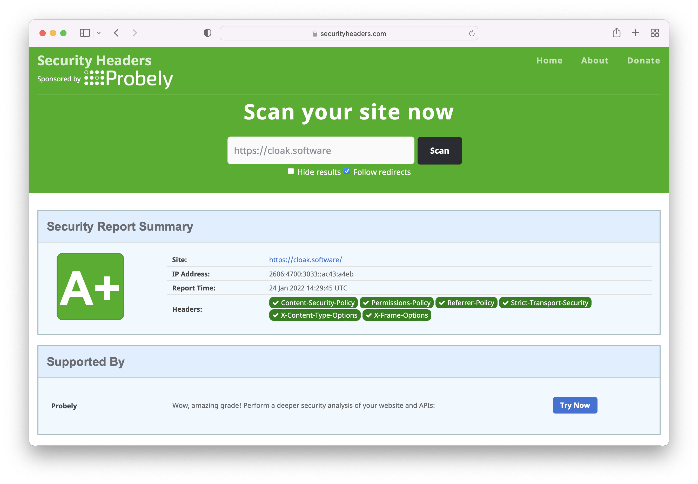

+++
title = "Add security headers to your web app with Envoy"
date = 2022-01-24

[extra]
main_image = "blog/add-security-headers-to-your-web-app-with-envoy/security-headers.png"
listing_image = "blog/add-security-headers-to-your-web-app-with-envoy/security-headers.png"
+++

Envoy gives you the option to run a LUA script against each route you define. So for example let's imagine you have created a route in envoy to your app.

```yaml
# Web request to our app
- match: { prefix: "/app" }
route: { cluster: app }
# Add security headers
typed_per_filter_config:
    envoy.filters.http.lua:
    "@type": type.googleapis.com/envoy.extensions.filters.http.lua.v3.LuaPerRoute
    name: app_headers.lua
```

We define our script within our filters, notice the function is called `envoy_on_response` it will catch all the responses from your route and add the headers.

```yaml
- name: envoy.filters.http.lua
    typed_config:
        "@type": type.googleapis.com/envoy.extensions.filters.http.lua.v3.Lua

        source_codes:
        app_headers.lua:
            inline_string: |
            function envoy_on_response(response_handle)
                csp = "default-src 'none'; script-src 'self'; img-src 'self'; style-src 'self'; connect-src 'self'";
                response_handle:headers():add("Content-Security-Policy", csp);
                response_handle:headers():add("X-Frame-Options", "deny");
                response_handle:headers():add("X-XSS-Protection", "1; mode=block");
                response_handle:headers():add("X-Content-Type-Options", "nosniff");
                response_handle:headers():add("Referrer-Policy", "no-referrer");
                response_handle:headers():add("X-Download-Options", "noopen");
                response_handle:headers():add("X-DNS-Prefetch-Control", "off");
                response_handle:headers():add("Strict-Transport-Security", "max-age=31536000; includeSubDomains");
                response_handle:headers():add("Permissions-Policy",
                                            "accelerometer=(), "..
                                            "camera=(), "..
                                            "geolocation=(), "..
                                            "gyroscope=(), "..
                                            "magnetometer=(), "..
                                            "microphone=(), "..
                                            "payment=(), "..
                                            "usb=()");
                response_handle:headers():remove("X-Powered-By");
            end
```

## Check your sites security headers

This is enough to get an A+ on https://securityheaders.com.





## But, we can do more

A very important part of the security headers is the `Content-Security-Policy` if we set the policy to the below we shut off JavaScript and therefore whole classes of attacks.

```
default-src 'none'; img-src 'self'; style-src 'self'
```

If you need to run JavaScript we can open up the policy like so.

```
default-src 'none'; script-src 'self'; img-src 'self'; style-src 'self'; connect-src 'self'
```

Now for any resources that break the policy you will get errors in the browser console. Things that will cause errors are inline JavaScript or CSS and perhaps any 3rd party services you are calling from the front end.

You can use https://csp-evaluator.withgoogle.com/ to see how effective your CSP is.

So ideally we want to stay with the policies above, opening up the policies more than this introduces potential ways for attackers to abuse your application.
